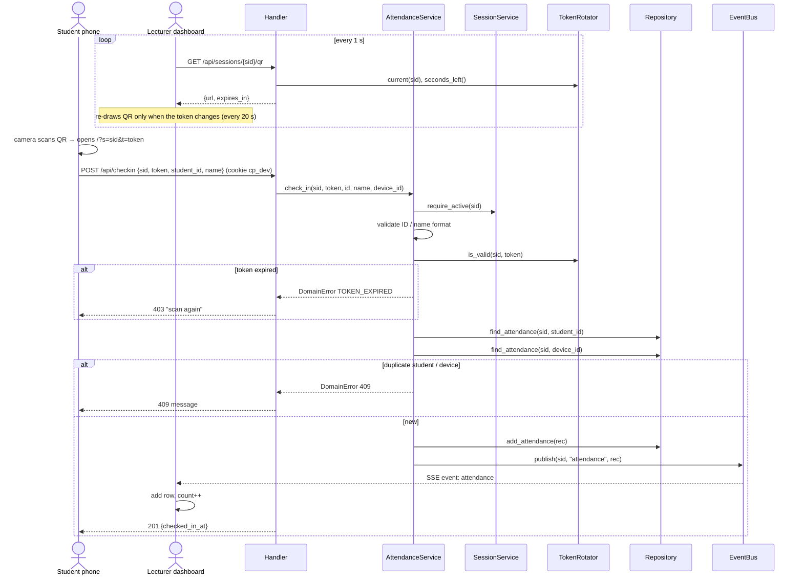
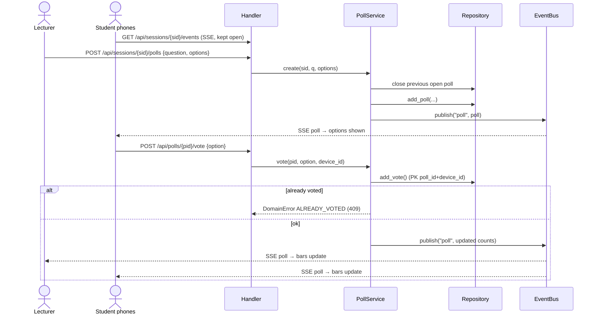
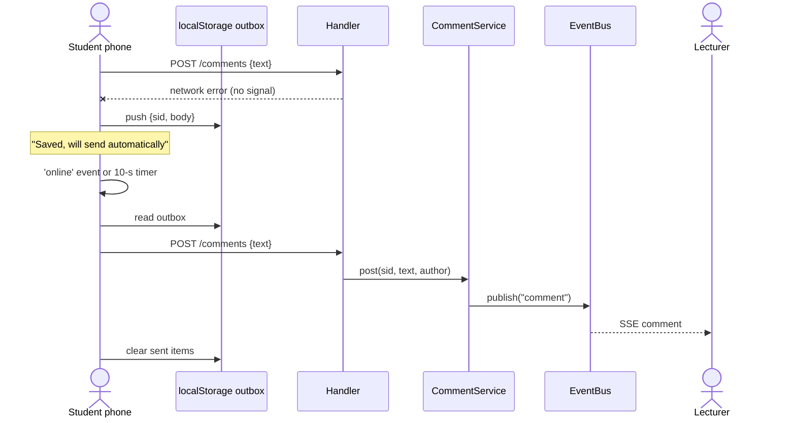
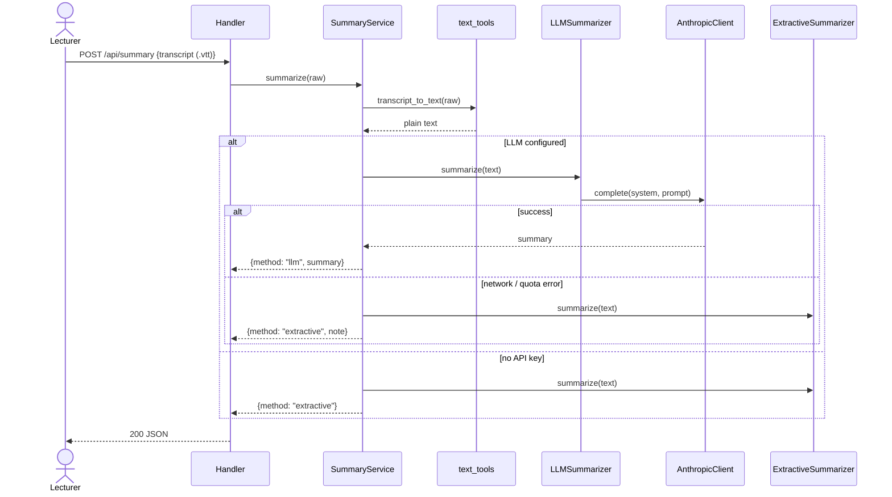
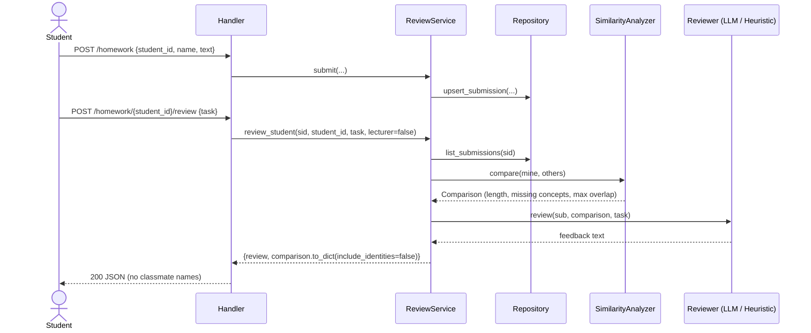

# 7. Sequence Diagrams

## 7.1 Check-in by QR (main feature)

```mermaid
sequenceDiagram
  actor St as Student phone
  actor Lc as Lecturer dashboard
  participant H as Handler
  participant A as AttendanceService
  participant S as SessionService
  participant T as TokenRotator
  participant R as Repository
  participant B as EventBus

  loop every 1 s
    Lc->>H: GET /api/sessions/{sid}/qr
    H->>T: current(sid), seconds_left()
    H-->>Lc: {url, expires_in}
    Note over Lc: re-draws QR only when the token changes (every 20 s)
  end
  St->>St: camera scans QR → opens /?s=sid&t=token
  St->>H: POST /api/checkin {sid, token, student_id, name} (cookie cp_dev)
  H->>A: check_in(sid, token, id, name, device_id)
  A->>S: require_active(sid)
  A->>A: validate ID / name format
  A->>T: is_valid(sid, token)
  alt token expired
    A-->>H: DomainError TOKEN_EXPIRED
    H-->>St: 403 "scan again"
  end
  A->>R: find_attendance(sid, student_id)
  A->>R: find_attendance(sid, device_id)
  alt duplicate student / device
    A-->>H: DomainError 409
    H-->>St: 409 message
  else new
    A->>R: add_attendance(rec)
    A->>B: publish(sid, "attendance", rec)
    B-->>Lc: SSE event: attendance
    Lc->>Lc: add row, count++
    H-->>St: 201 {checked_in_at}
  end
```

## 7.2 Live poll

```mermaid
sequenceDiagram
  actor Lc as Lecturer
  actor St as Student phones
  participant H as Handler
  participant P as PollService
  participant R as Repository
  participant B as EventBus

  St->>H: GET /api/sessions/{sid}/events (SSE, kept open)
  Lc->>H: POST /api/sessions/{sid}/polls {question, options}
  H->>P: create(sid, q, options)
  P->>R: close previous open poll
  P->>R: add_poll(...)
  P->>B: publish("poll", poll)
  B-->>St: SSE poll → options shown
  St->>H: POST /api/polls/{pid}/vote {option}
  H->>P: vote(pid, option, device_id)
  P->>R: add_vote() (PK poll_id+device_id)
  alt already voted
    P-->>H: DomainError ALREADY_VOTED (409)
  else ok
    P->>B: publish("poll", updated counts)
    B-->>Lc: SSE poll → bars update
    B-->>St: SSE poll → bars update
  end
```

## 7.3 Offline comment

```mermaid
sequenceDiagram
  actor St as Student phone
  participant LS as localStorage outbox
  participant H as Handler
  participant C as CommentService
  participant B as EventBus
  actor Lc as Lecturer

  St->>H: POST /comments {text}
  H--xSt: network error (no signal)
  St->>LS: push {sid, body}
  Note over St: "Saved, will send automatically"
  St->>St: 'online' event or 10-s timer
  St->>LS: read outbox
  St->>H: POST /comments {text}
  H->>C: post(sid, text, author)
  C->>B: publish("comment")
  B-->>Lc: SSE comment
  St->>LS: clear sent items
```

## 7.4 Lesson summary

```mermaid
sequenceDiagram
  actor Lc as Lecturer
  participant H as Handler
  participant SS as SummaryService
  participant TT as text_tools
  participant LS as LLMSummarizer
  participant LLM as AnthropicClient
  participant ES as ExtractiveSummarizer

  Lc->>H: POST /api/summary {transcript (.vtt)}
  H->>SS: summarize(raw)
  SS->>TT: transcript_to_text(raw)
  TT-->>SS: plain text
  alt LLM configured
    SS->>LS: summarize(text)
    LS->>LLM: complete(system, prompt)
    alt success
      LLM-->>SS: summary
      SS-->>H: {method: "llm", summary}
    else network / quota error
      SS->>ES: summarize(text)
      SS-->>H: {method: "extractive", note}
    end
  else no API key
    SS->>ES: summarize(text)
    SS-->>H: {method: "extractive"}
  end
  H-->>Lc: 200 JSON
```

## 7.5 Homework review

```mermaid
sequenceDiagram
  actor St as Student
  participant H as Handler
  participant RS as ReviewService
  participant R as Repository
  participant SA as SimilarityAnalyzer
  participant RV as Reviewer (LLM / Heuristic)

  St->>H: POST /homework {student_id, name, text}
  H->>RS: submit(...)
  RS->>R: upsert_submission(...)
  St->>H: POST /homework/{student_id}/review {task}
  H->>RS: review_student(sid, student_id, task, lecturer=false)
  RS->>R: list_submissions(sid)
  RS->>SA: compare(mine, others)
  SA-->>RS: Comparison (length, missing concepts, max overlap)
  RS->>RV: review(sub, comparison, task)
  RV-->>RS: feedback text
  RS-->>H: {review, comparison.to_dict(include_identities=false)}
  H-->>St: 200 JSON (no classmate names)
```
